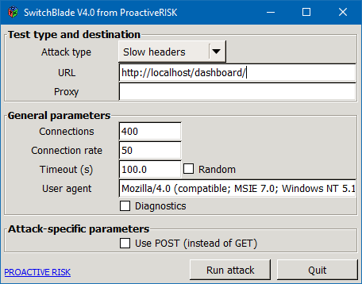
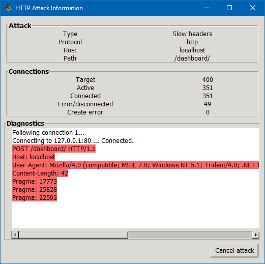

# SI LAB.2

Denial-of-service (DoS) attacks typically flood servers, systems or networks with traffic in order to overwhelm the victim resources and make it difficult or impossible for legitimate users to use them. While an attack that crashes a server can often be dealt with successfully by simply rebooting the system, flooding attacks can be more difficult to recover from.

For this lab. work I used the OWASP app.

And also I used my code for slowloris attack.

